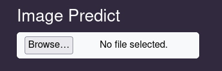
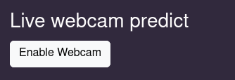

# Buka aplikasi web ini secara online
https://herdyhardiyant.github.io/web_apd_detector/

# Cara menjalankan aplikasi web di lokal
```
$ cd web_apd_detector
$ python -m http.server
Buka 'localhost:8000' di browser
```

**Tolong jangan menggunakan http://0.0.0.0:8000/ agar model tensorflowjs tidak terblokir.**


# Cara menggunakan aplikasi web ini
Pertama, tunggu loading model AI sampai menu untuk prediksi muncul. 

Deteksi input gambar dapat dilakukan dengan cara klik browse untuk memilih gambar yang ingin dideteksi




Deteksi input video, dengan cara klik browse untuk upload video yang ingin dideteksi di menu Video Predict


Live webcam dengan cara klik enable webcam di menu live webcam predict, kemudian berikan izin untuk mengakses camera. 



# Proses pencarian dataset
Saya memilih dataset object detection helm dari url berikut
https://universe.roboflow.com/hardhats/hardhats-ctl1u/dataset/2/images
https://universe.roboflow.com/universe-datasets/hard-hat-universe-0dy7t
https://universe.roboflow.com/fauzan-ihza-fajar/apd-detection-zvjb2

Saya memilih dataset ini karena sudah diberikan bounding box di sekitar gambar helm yang digunakan seseorang. Gambar - gambarnya juga memiliki pencahayaan yang baik dan sudah diberikan label 'helmet' sebagai label menggunakan helm dan 'head' sebagai label tidak menggunakan helm. Tetapi dataset memiliki gambar dan label yang tidak berhubungan dengan AI model yang akan dilatih sehingga diperlukannya data cleaning.

# Preprocessing
Preprocessing dilakukan secara lokal untuk menghemat unit compute google collab.

1. Dataset diunduh dengan format CSV Tensorflow Object Detection.
2. Dataset dibersihkan dari gambar yang tidak dibutuhkan dan dibuat split train set dan test set
3. Konversi dataset train dan test ke tfrecord
4. Membuat label map
5. Compress dataset tfrecord ke .tar.xz
6. Karena proses training dilakukan melalui google collab, Dataset diupload ke dropbox agar proses download di google collab menjadi cepat.

# Training
Proses latih model AI dilakukan di **training_object_detection.ipynb**
